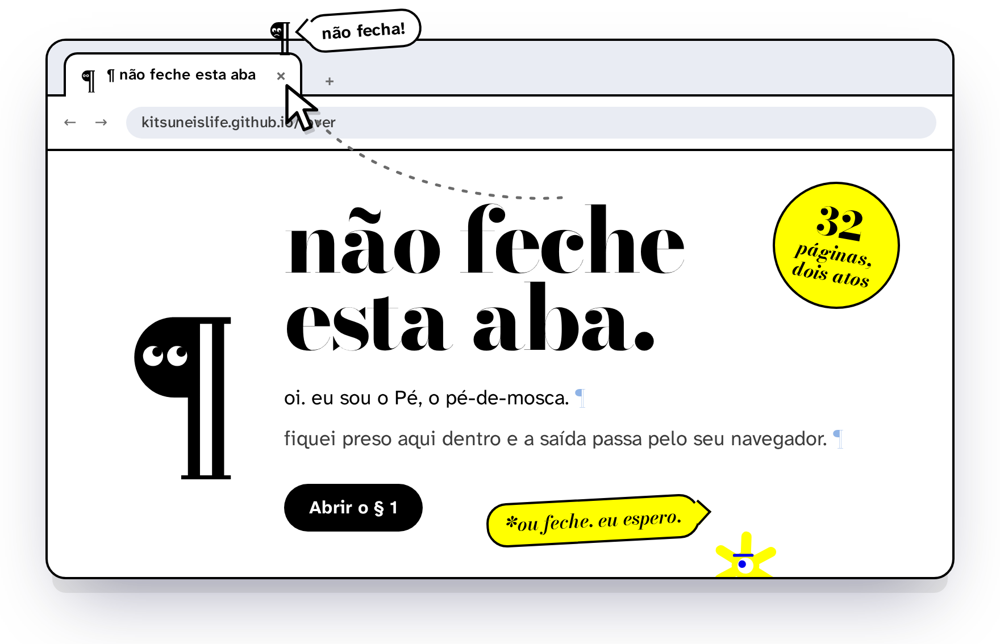
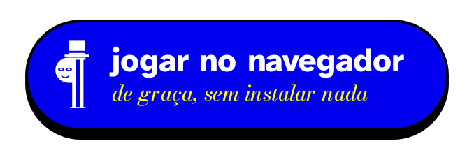
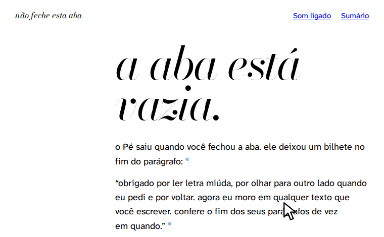
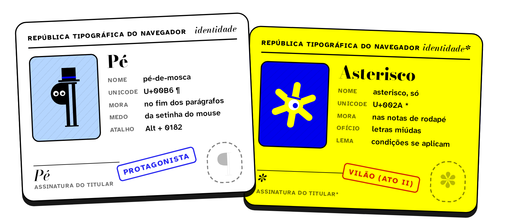
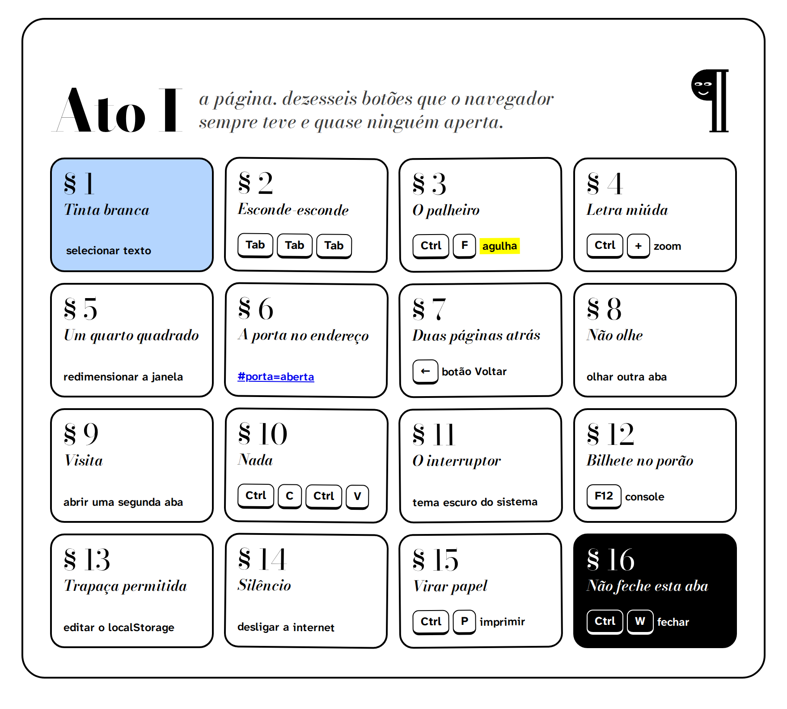
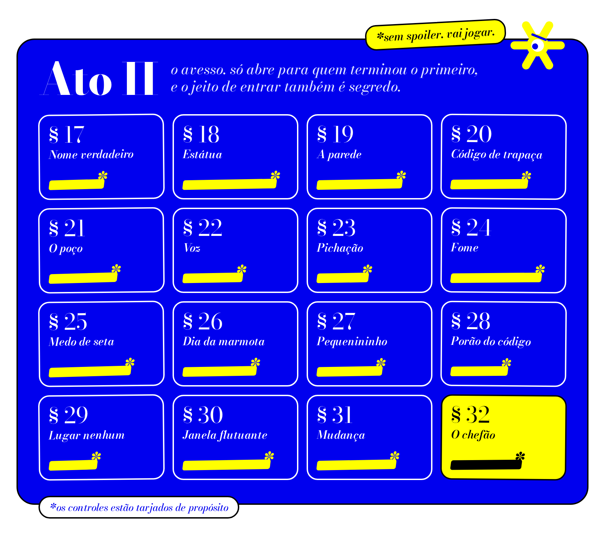
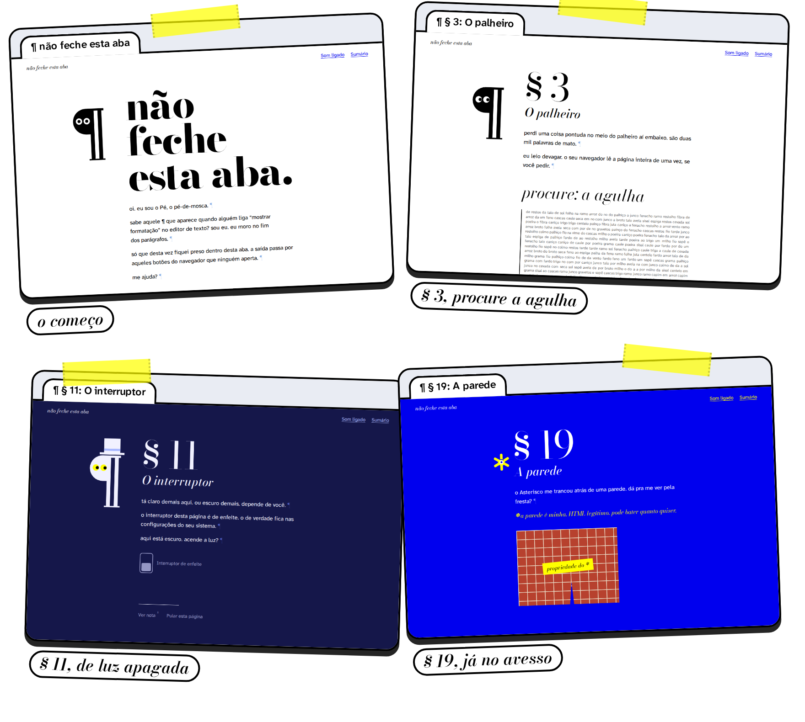
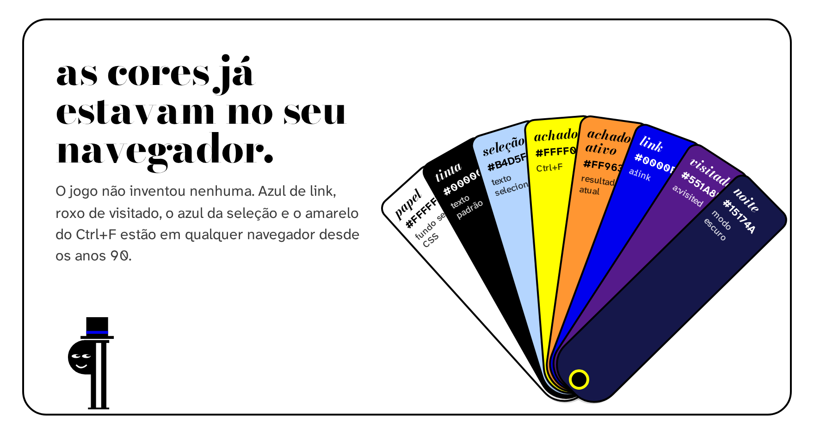
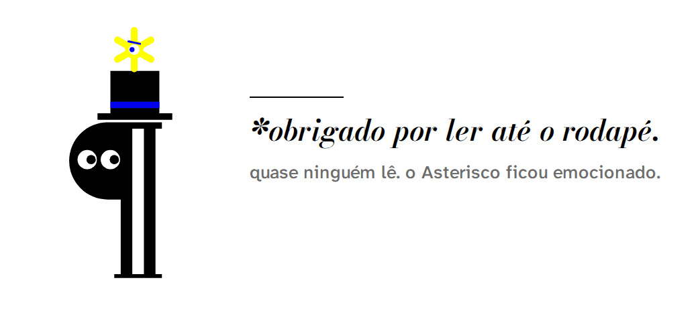

<div align="center">

<picture>
  <source media="(prefers-color-scheme: dark)" srcset="docs/readme/hero-escuro.png">
  
</picture>

<a href="https://kitsuneislife.github.io/lover/"></a>

</div>

Um jogo de quebra-cabeça em que o controle é o seu navegador. Para resolver cada página você usa um botão que sempre esteve ali e que quase ninguém aperta: Ctrl+F, zoom, o botão Voltar, a barra de endereço, o console, a prévia de impressão.

São 32 páginas em dois atos. O jogo é HTML, CSS e JavaScript sem build nem servidor, salva o progresso no próprio navegador e funciona offline depois da primeira visita.

<p align="center">
  
  <br>
  <sub>O fim do Ato I, gravado do jogo. Um clique no ponto final e a página inteira cai.</sub>
</p>

## Quem mora aqui

<p align="center"></p>

O **Pé** é o ¶ que aparece no fim dos parágrafos quando alguém liga "mostrar formatação" no editor de texto. Ele ficou preso numa aba e fala com você letra por letra, pelo título da aba, pelo favicon e, se você abrir, pelo console.

O **Asterisco** aparece no Ato II. Ele mora nas notas de rodapé, cuida das letras miúdas e dá as dicas do avesso, sempre com um `*` na frente.

## Ato I, a página

<p align="center"></p>

A última página pede o que o título proíbe. Quando você volta depois de fechar a aba, o jogo sabe.

## Ato II, o avesso

<p align="center"></p>

Só aparece para quem termina o primeiro ato. As páginas são mais difíceis e mais esquisitas, e o chefão cobra tudo o que você aprendeu antes, contra o relógio.

## Como fica na tela

<p align="center"></p>

## As cores

<p align="center"></p>

Cada decisão de design, da tipografia à paleta do avesso, está em [`docs/DESIGN.md`](docs/DESIGN.md).

<details>
<summary><b>O que cada página usa</b> (spoilers dos dois atos)</summary>

| § | Página | Recurso do navegador |
|---|---|---|
| 1 | Tinta branca | seleção de texto, `selectionchange` |
| 2 | Esconde-esconde | tecla Tab, `:focus-visible` |
| 3 | O palheiro | Ctrl+F com `hidden="until-found"` e o evento `beforematch` |
| 4 | Letra miúda | zoom, `devicePixelRatio`, media query `resolution`, `visualViewport` |
| 5 | Um quarto quadrado | redimensionar a janela, `screen.orientation` no celular |
| 6 | A porta no endereço | editar o `#` da URL, `hashchange` |
| 7 | Duas páginas atrás | botão Voltar, `history.pushState` e `popstate` |
| 8 | Não olhe | Page Visibility API, título da aba como canal de conversa |
| 9 | Visita | segunda aba, `BroadcastChannel` |
| 10 | Nada | copiar e colar, evento `copy` que troca o conteúdo |
| 11 | O interruptor | tema do sistema, `prefers-color-scheme` |
| 12 | Bilhete no porão | console do DevTools, função global |
| 13 | Trapaça permitida | editar o `localStorage` à mão |
| 14 | Silêncio | ficar offline, service worker, sonda de rede |
| 15 | Virar papel | prévia de impressão, `beforeprint`, folha de estilo `print` que vira pôster |
| 16 | Não feche esta aba | fechar a aba, `pagehide` |
| 17 | Nome verdadeiro | digitar ¶ pelo teclado (Alt+0182, Option+7) |
| 18 | Estátua | 40 s sem mouse, teclado, rolagem ou troca de aba, com provocações na tela |
| 19 | A parede | apagar um `<div>` pelo DevTools |
| 20 | Código de trapaça | código Konami, ou deslizes do dedo no celular |
| 21 | O poço | página de 300 mil pixels, tecla End |
| 22 | Voz | `speechSynthesis`, a senha falada em voz alta |
| 23 | Pichação | editar o texto da página com `document.designMode` |
| 24 | Fome | arrastar um arquivo para a página, File API |
| 25 | Medo de seta | tirar o mouse da janela, `mouseleave` |
| 26 | Dia da marmota | recarregar seis vezes, `sessionStorage` e o tipo de navegação |
| 27 | Pequenininho | código de quatro dígitos animado no favicon |
| 28 | Porão do código | comentário HTML no código-fonte, Ctrl+U |
| 29 | Lugar nenhum | visitar uma URL que não existe; o `404.html` avisa o jogo |
| 30 | Janela flutuante | Picture-in-Picture de um vídeo gerado por `canvas.captureStream` |
| 31 | Mudança | levar a janela para o canto da tela, `screenX` e `screenY` |
| 32 | O chefão | seis tarefas do Ato I sorteadas, em 100 segundos |

O § 14 não confia só em `navigator.onLine`, que continua `true` com o Wi-Fi ligado num roteador sem internet. A cada 2,5 s o jogo busca `sonda.txt` sem cache, e o service worker deixa essa busca ir direto para a rede.

</details>

## Rodar no seu computador

Precisa de Node 18 ou mais novo.

```sh
npm install
npm run dev        # o jogo em http://localhost:8000
```

O `npm run dev` usa `tools/servidor.mjs`, que imita o GitHub Pages e devolve o `404.html` para endereços que não existem. Sem isso o § 29 não funciona. Abrir o `index.html` direto do disco quebra os módulos JavaScript e o service worker.

## Testes

```sh
npm test           # joga os dois atos inteiros no Chromium headless
npm run test:ato1  # só as 16 primeiras páginas
npm run test:ato2  # a passagem e as 16 do avesso
```

Os testes resolvem cada página com a ação de verdade sempre que o Playwright permite: seleção, Tab, Ctrl+C e Ctrl+V, zoom, botão Voltar, offline, segunda aba, arquivo, End, F5. O que um navegador headless não consegue fazer (esconder a aba, abrir Picture-in-Picture, mover a janela na tela) é simulado disparando o evento. O workflow `testes.yml` roda tudo a cada push e pull request.

## Publicar

O workflow `pages.yml` publica a pasta `site/` a cada push na `main` que mexa nela. Na primeira vez, vá em **Settings → Pages** e escolha **GitHub Actions** como fonte.

Para a prévia que aparece quando alguém compartilha o link do repositório, envie `docs/readme/social.png` em **Settings → General → Social preview**.

## Organização

```
site/                     o jogo, exatamente como é publicado
├── index.html            página única (tem um comentário que interessa ao § 28)
├── 404.html              página de erro que também é fase (§ 29)
├── sw.js                 cache offline
├── sonda.txt             o § 14 busca este arquivo para saber se há internet
├── css/                  tela dos dois atos e o pôster impresso
├── js/
│   ├── main.js           telas, dicas, abas, os dois atos, salvamento
│   ├── pe.js             o Pé em SVG
│   ├── asterisco.js      o Asterisco em SVG
│   ├── fx.js             som, favicon, título da aba, console
│   └── fases/            uma página do jogo por arquivo, 01 a 32
└── assets/               fontes e ícone
docs/
├── DESIGN.md             paleta, tipografia, personagens e decisões
└── readme/               as imagens deste README e o HTML que as gera
tests/                    os dois atos jogados pelo Playwright
tools/
├── servidor.mjs          servidor local com 404 igual ao do GitHub Pages
└── render-readme.mjs     fotografa o HTML de docs/readme/fonte/ e grava PNG e GIF
```

## Criar uma página nova

Crie um arquivo em `site/js/fases/`, adicione na lista de `site/js/fases/index.js` e no array `ARQUIVOS` do `site/sw.js`. Suba a `VERSAO` do `sw.js` para quem já jogou receber os arquivos novos.

```js
export default {
  id: "minha-fase",
  nome: "Nome que aparece no sumário",
  celular: true,            // false mostra um aviso e libera o pular no celular
  falas: ["o que o Pé diz antes", "*fala que começa com asterisco é do Asterisco"],
  dicas: ["primeira nota", "segunda nota", "terceira nota"],
  vitoria: ["o que o Pé diz depois"],
  montar(ctx) {
    // ctx.palco: onde desenhar o puzzle
    // ctx.on(alvo, evento, fn): ouvinte removido sozinho ao sair da página
    // ctx.dizer(html), ctx.resolver(), ctx.pe, ctx.ast, ctx.som, ctx.titulo, ctx.favicon(svg)
  },
};
```

## As imagens deste README

Todas saem de HTML em `docs/readme/fonte/`, com as mesmas fontes do jogo e os personagens importados de `site/js/`. O GIF da passagem é gravado do jogo rodando.

```sh
npm run readme          # gera tudo
npm run readme -- ato   # só as imagens com "ato" no nome
```

## Créditos

Fontes [Bodoni Moda](https://fonts.google.com/specimen/Bodoni+Moda) e [Atkinson Hyperlegible Next](https://fonts.google.com/specimen/Atkinson+Hyperlegible+Next), sob a SIL Open Font License 1.1. Código sob a licença GPL-3.0, no arquivo [`LICENSE`](LICENSE).

<p align="center">
  <picture>
    <source media="(prefers-color-scheme: dark)" srcset="docs/readme/rodape-escuro.gif">
    
  </picture>
</p>
